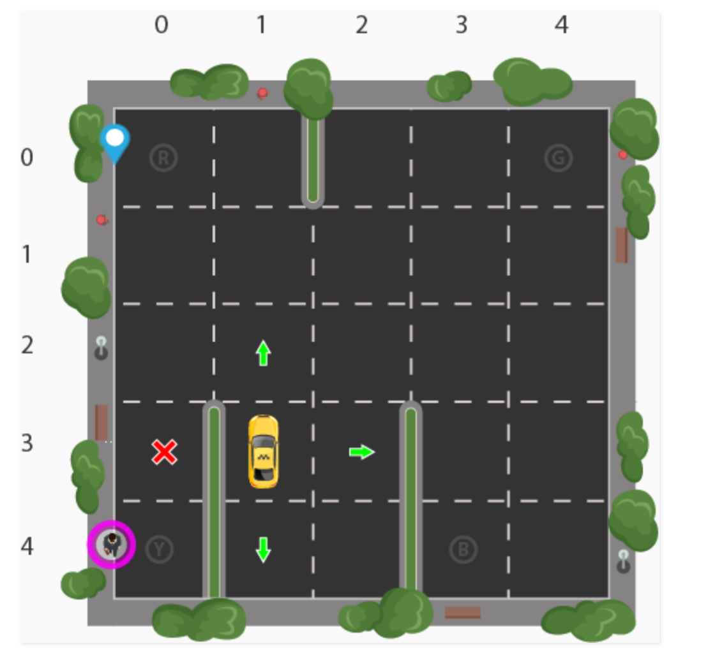

# python-rl-application
## Conda Environment Setup
**Create environment from environment.yml**:  
*From base directory:*  
```conda env create -f ./environment.yml```

**Update environment from environment.yml**:  
*From base directory and after activating existing environment:*  
```conda env update --file ./environment.yml```

## Execution Guide
This application is a console application and is intended to be run in a shell because of the frame displays. To run this script, navigate to the base directory and execute 

## Self-Driving Cab
### Rewards
- High positive reward for a successful drop-off because this behaviour is highly desired
- High negative reward for an unsuccessful drop-off
- Slight negative reward for not making it to the destination after every time-step
    - "Slight" because reaching the destination late is better than making wrong moves trying to reach the destination as fast as possible
    
### State Space
Consider the following image depicting the environment:


*Figure 1: Cab environment*

Our illustrated passenger is in position Y and wants to go to position R. There are 5x5 locations that the cab can be in. There are 5 locations that the passenger can be in (4 pickup locations plus inside the cab). There are also 4 possible drop-off locations. Therefore, the state-space is 5x5x5x4 = 500. 

### Action Space
The agent has 6 possible actions:
1. Drive south one square
2. Drive north one square
3. Drive east one square
4. Drive west one square
5. Pickup
6. Drop-off

### Algorithm
The algorithm that will be implemented is a simple Q-learning algorithm. This algorithm was chosen because the state space is small enough such that function approximators are not needed for the entries in the Q-table. 

The Q-learning algorithm updates the entries in the Q-table using a simple update equation:

```python
new_value = (1 - alpha) * old_value + alpha * (reward + gamma * next_max)
```

The hyper-paremeters alpha and gamma are pre-determined values that we set prior to running our algorithm. The ```old_value``` is the old Q-value given a particular state-action coordinate in the Q-table and the ```next_max``` is the maximum Q-value extracted from the row corresponding to the next state. Using this update equation, the Q-table, which approximates the utility of actions given states, will become more and more accurate. 

With respect to exploration and exploitation, we use a non-decaying epsilon value to balance exploration and exploitation. A more sophisticated strategy would decay epsilon as the Q-table became more accurate because a more accurate Q-table should exploit its knowledge more frequently.

### Conclusion
This project was a simple RL application that provided me with the fundamentals to explore more complex RL frameworks and applications. 